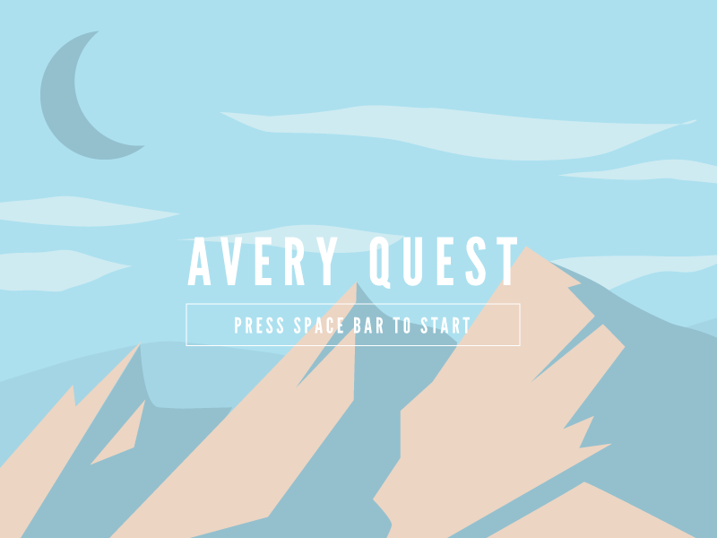

# AVERYQUEST  

## Demo 
[Averyquest Demo](https://youtu.be/bFAfmPS-jmY)

## Try it out!
[Play Averyquest](http://averyquest.mikeboice.com)

## IPAS AND APIS Hackathon  
  

### Setup    
npm install http-server -g    
cd averyquest    
http-server .  

#### Avery Beer Logos
Beer logos were downloaded via the "Brand Assets" link on the Avery Brewing website. It leads to the following site: https://brandfolder.com/averybrewing/brand

### API Usage
NOTE: apis.mondorobot.com has been taken down. Using static data now.

1. http://apis.mondorobot.com/beers to populate game beers.  
- higher ABVs get Hop Johnson more drunk
- label is used for the game icon
- uses name and id

2.  http://apis.mondorobot.com/beers?categories=Hop-forward
brew filter used to get hoppy beers in the tap room
uses this filter in conjunction with a beers ABV to reward "hop" bonus
collect more hops to make Hop John jump higher

